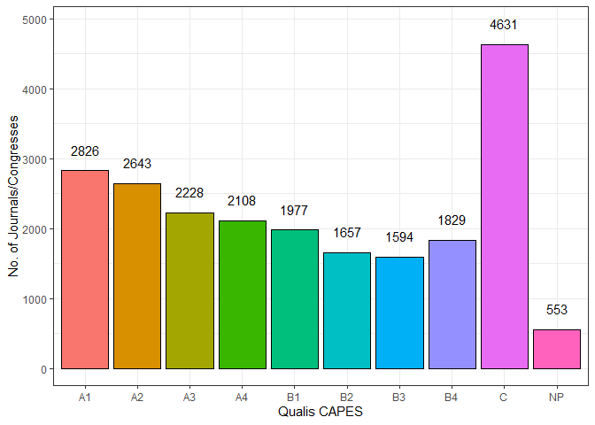

<!-- README.md is generated from README.Rmd. Please edit that file -->

# qualiscapes

<!-- badges: start -->

[](https://github.com/ramongss/qualiscapes/actions)
<!-- badges: end -->

The goal of `qualiscapes` is to get the preliminary 2019 QUALIS CAPES.

## Installation

You can install the development version from
[GitHub](https://github.com/) with:

``` r
# install.packages("devtools")
devtools::install_github("ramongss/qualiscapes")
```

## Example

Retrieve the data from the `get_qualis()` function, and show the head of
the dataframe.

``` r
da_qualis <- qualiscapes::get_qualis(file = NULL)

head(da_qualis)
#> # A tibble: 6 x 3
#>   ISSN_2019 TITULO_2019                                             ESTRATO_2019
#>   <chr>     <chr>                                                   <fct>       
#> 1 2328-0662 # ISOJ JOURNAL                                          C           
#> 2 2238-0272 #10.ART                                                 NP          
#> 3 2177-5141 (N.T.) REVISTA LITERÁRIA EM TRADUÇÃO                    C           
#> 4 2237-5953 (RE) PENSANDO DIREITO                                   B4          
#> 5 2318-7344 @RQUIVO BRASILEIRO DE EDUCAÇÃO                          C           
#> 6 2409-3823 [C]COMPASSESWORLD: THE ARCHITECTURE AND INTERIOR DESIG~ NP
```

Summarize the dataframe counting the number of journals/congresses
according to the Qualis CAPES.

``` r
count_qualis <- 
  da_qualis %>% 
  dplyr::mutate(qualis = ESTRATO_2019) %>% 
  dplyr::group_by(qualis) %>% 
  dplyr::summarise(count = dplyr::n())

count_qualis
#> # A tibble: 10 x 2
#>    qualis count
#>    <fct>  <int>
#>  1 A1      2826
#>  2 A2      2643
#>  3 A3      2228
#>  4 A4      2108
#>  5 B1      1977
#>  6 B2      1657
#>  7 B3      1594
#>  8 B4      1829
#>  9 C       4631
#> 10 NP       553
```

Plot the `count_qualis` dataframe to visualize the number of
journals/congresses according to the preliminary 2019 Qualis CAPES.

``` r
count_qualis %>% 
  ggplot2::ggplot(ggplot2::aes(x = qualis, y = count)) +
  ggplot2::geom_col(ggplot2::aes(fill = qualis), colour = "black", show.legend = FALSE) +
  ggplot2::geom_text(ggplot2::aes(label = count), nudge_y = 300) +
  ggplot2::theme_bw() +
  ggplot2::labs(x = "Qualis CAPES", y = "No. of Journals/Congresses") +
  ggplot2::scale_color_discrete()
```


